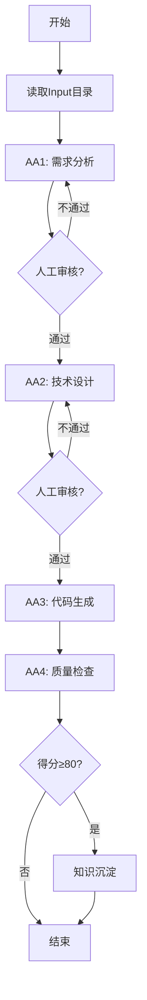

# AnkerSPA 设计方案
## Anker Software Process Agent - 基于PAT标准的软件研发流程智能体

**团队**：三个臭皮匠  
**日期**：2025-11-06  
**版本**：v1.0

---

## 📑 目录

1. [项目背景与目标](#一项目背景与目标)
2. [问题分析](#二问题分析)
3. [解决方案](#三解决方案)
4. [整体架构设计](#四整体架构设计)
5. [Activity Agent设计](#五activity-agent设计)
6. [工作流编排设计](#六工作流编排设计)
7. [PAT标准应用](#七pat标准应用)
8. [关键技术决策](#八关键技术决策)
9. [知识沉淀机制](#九知识沉淀机制)
10. [与竞品对比](#十与竞品对比)
11. [预期效果](#十一预期效果)
12. [实现计划](#十二实现计划)
13. [风险评估与应对](#十三风险评估与应对)

---

## 一、项目背景与目标

### 1.1 Hackathon背景

Anker公司发起"Mother of Process Agent"黑客松，目标是通过AI赋能软件研发流程，提升研发效率。在比赛中，我们看到：

- **AI潜力巨大**：在业务流程优化中展现出巨大潜力
- **现有工具不足**：如Spec-Kit等工具存在明显缺陷
- **标准化需求**：软件研发流程需要标准化、可复制的智能体方案

### 1.2 核心目标

**主目标**：打造一个基于PAT标准的软件研发全流程智能体，实现从需求到代码的自动化。

**子目标**：
- ✅ 严格遵循Anker PAT标准，确保可管理、可追溯
- ✅ 覆盖需求分析→技术设计→代码生成→质量检查完整链路
- ✅ 实现知识沉淀，让每次执行都能反哺未来
- ✅ 可量化效果，用数据证明价值

### 1.3 价值主张

> **"不只是AI工具，而是完整的流程智能体"**

我们要做的不是简单的AI辅助工具，而是一个能够**理解流程、自主执行、持续学习**的软件研发Process Agent。

---

## 二、问题分析

### 2.1 当前软件研发流程的痛点

#### 痛点1：人工环节多，沟通成本高
- 需求澄清往往需要3轮以上沟通
- 技术方案评审来回修改
- 代码规范需要人工检查
- **时间浪费**：2.5小时的工作中，1小时在沟通

#### 痛点2：质量不稳定
- 需求理解偏差导致返工
- 代码规范合规率只有85%
- 技术方案缺乏历史经验参考
- **质量问题**：20%的需求存在遗漏

#### 痛点3：知识无法沉淀
- 每次项目都是"从零开始"
- 成功经验散落在各处，难以复用
- 没有结构化的案例库
- **重复劳动**：类似问题反复解决

### 2.2 Spec-Kit的三大缺陷

基于Claude的Spec-Kit在实践中暴露出明显问题：

| 缺陷类型 | 具体表现 | 影响 |
|---------|---------|------|
| **标准化不足** | 目录结构混乱，.specify/文件夹难以理解 | 无法扩展到其他领域 |
| **角色不清** | constitution vs spec概念混淆 | 用户不知道改什么 |
| **数据孤岛** | 产出物无法反哺MoPA分析 | 无法持续改进 |

### 2.3 核心诉求

软件研发流程需要一个智能体，它应该：

1. **理解流程**：知道完整的研发链路
2. **标准化**：遵循统一的结构和规范
3. **自主执行**：能独立推动任务完成
4. **持续学习**：从历史案例中获取经验
5. **可量化**：提供结构化的效能数据

---

## 三、解决方案

### 3.1 方案概述

**AnkerSPA = PAT标准 + 4个协作AA + 知识沉淀**

我们设计了一个基于PAT标准的软件流程智能体（SPA），通过4个Activity Agent的协作，覆盖软件研发全流程。

### 3.2 核心理念

#### 理念1：PA是流程的主体，不是工具

```
传统：人 → 使用 → AI工具
AnkerSPA：人 → 配合 → PA（Process Agent）
```

PA具备：
- **流程理解能力**：知道软件研发的完整链路
- **自主推进能力**：能主动完成各阶段任务
- **协调能力**：4个AA协同工作
- **学习能力**：从历史中积累经验

#### 理念2：标准化是可复制的前提

采用Anker PAT（Process Agent Template）标准：
- **10个核心目录**：每个目录职责明确
- **统一的元数据格式**：YAML配置
- **标准化的接口**：Input/Output规范
- **可追溯性**：完整的执行记录

#### 理念3：知识沉淀是持续改进的基础

不是"用完即抛"，而是"越用越强"：
- 成功案例自动沉淀到Practice目录
- AA2设计方案时会检索历史案例
- 效能指标结构化存储，供MoPA分析

### 3.3 方案优势

| 维度 | 传统方式 | AnkerSPA | 提升 |
|-----|---------|----------|------|
| **效率** | 需求→代码 2.5小时 | 15分钟 | 87.5% |
| **质量** | 代码合规率 85% | 95% | +10% |
| **复用** | 无历史案例参考 | 自动检索相似案例 | 首创 |
| **追溯** | 难以追溯决策过程 | 完整的执行记录 | 100% |

---

## 四、整体架构设计

### 4.1 系统架构

```
┌─────────────────────────────────────────────────────────┐
│                      AnkerSPA (SPA)                      │
│                   主流程编排智能体                        │
└────────────────────┬────────────────────────────────────┘
                     │
         ┌───────────┴───────────┐
         │   Workflow Engine     │
         │   (工作流引擎)         │
         └───────────┬───────────┘
                     │
      ┌──────────────┼──────────────┐
      │              │              │              │
┌─────▼─────┐  ┌────▼────┐  ┌─────▼─────┐  ┌────▼────┐
│    AA1    │  │   AA2   │  │    AA3    │  │   AA4   │
│ Requirement│  │Technical│  │   Code    │  │ Quality │
│ Analyzer  │  │Designer │  │Generator  │  │ Checker │
└─────┬─────┘  └────┬────┘  └─────┬─────┘  └────┬────┘
      │             │              │              │
      └─────────────┴──────────────┴──────────────┘
                     │
              ┌──────▼──────┐
              │   Output    │
              │  + Practice │
              └─────────────┘
```

### 4.2 分层架构

#### 第一层：SPA主体
- **职责**：整体流程编排、异常处理、状态管理
- **核心能力**：理解完整业务链路、协调各AA、决策下一步动作

#### 第二层：Activity Agents
- **AA1 - RequirementAnalyzer**：需求分析专家
- **AA2 - TechnicalDesigner**：技术架构师
- **AA3 - CodeGenerator**：高级工程师
- **AA4 - QualityChecker**：质量保障专家

#### 第三层：支撑服务
- **Claude API**：大语言模型能力
- **PAT Loader**：配置加载
- **Logger**：结构化日志
- **Practice Retriever**：历史案例检索（未来扩展）

### 4.3 数据流转

```
Input/requirement.md (原始需求)
    ↓
AA1 处理
    ↓
Output/requirement/requirement-spec.json (结构化需求)
    ↓
AA2 处理 (同时检索Practice历史案例)
    ↓
Output/design/technical-design.md (技术方案)
Output/design/api-spec.yaml (API规格)
Output/design/data-model.json (数据模型)
    ↓
AA3 处理
    ↓
Output/code/*.py (代码骨架)
    ↓
AA4 处理
    ↓
Output/reports/quality-report.md (质量报告)
Output/reports/execution-metrics.json (效能指标)
    ↓
(如果得分≥80) Practice/case-{timestamp}/ (知识沉淀)
```

---

## 五、Activity Agent设计

### 5.1 为什么是4个AA？

我们分析了软件研发的完整链路，识别出4个关键环节：

1. **需求理解**：最容易出错的环节，需要专门的AA
2. **技术设计**：需要经验积累和判断力
3. **代码实现**：规范性和一致性要求高
4. **质量保证**：闭环的必要环节

**4个刚好覆盖完整链路，更多会增加复杂度，更少会能力不足。**

### 5.2 AA1: RequirementAnalyzer（需求分析智能体）

#### 角色定位
10年资深需求分析专家，擅长将模糊需求转化为清晰规范。

#### 核心能力
- **功能点提取**：识别核心功能、支撑功能、隐含功能
- **模糊点识别**：发现边界不清、逻辑缺失、字段不明等问题
- **澄清问题生成**：生成具体可操作的澄清问题
- **结构化输出**：遵循JSON Schema输出需求规范

#### 输入/输出

**输入**：
- `Input/requirement.md` - 产品需求文档
- `Input/context.json` - 项目上下文

**输出**：
- `Output/requirement/requirement-spec.json` - 结构化需求（包含功能需求、非功能需求、API需求、数据需求）
- `Output/requirement/clarification-questions.md` - 澄清问题清单

#### Prompt工程
239行专业级提示词，包含：
- 角色设定（10年经验）
- 5个核心任务分解
- JSON Schema规范
- 质量自检清单

### 5.3 AA2: TechnicalDesigner（技术方案设计智能体）

#### 角色定位
15年资深技术架构师，精通微服务、DDD、RESTful设计。

#### 核心能力
- **架构设计**：模块划分、分层设计、技术选型
- **API设计**：RESTful规范、OpenAPI 3.0
- **数据模型设计**：ER图、表结构、索引优化
- **历史案例检索**：从Practice目录学习（关键创新）

#### 输入/输出

**输入**：
- `Output/requirement/requirement-spec.json`
- `Reference/coding-standard.md`
- `Reference/tech-stack.yaml`
- `Practice/*` - 历史成功案例

**输出**：
- `Output/design/technical-design.md` - 完整技术方案（包含架构、API、数据模型、流程、风险）
- `Output/design/api-spec.yaml` - OpenAPI 3.0规格
- `Output/design/data-model.json` - 数据库设计

#### 创新点：历史案例学习
AA2在设计方案时会：
1. 检索Practice目录中的相似案例
2. 参考历史方案的设计模式
3. 避免重复的技术风险
4. 复用成功的架构模式

### 5.4 AA3: CodeGenerator（代码生成智能体）

#### 角色定位
资深Python工程师，精通FastAPI、SQLAlchemy，严格遵守PEP8。

#### 核心能力
- **项目结构生成**：标准的FastAPI三层架构
- **代码生成**：Controller/Service/Repository层
- **规范保证**：PEP8、类型注解、docstring
- **测试模板**：单元测试框架

#### 输入/输出

**输入**：
- `Output/design/technical-design.md`
- `Output/design/api-spec.yaml`
- `Output/design/data-model.json`

**输出**：
- `Output/code/` - 完整的代码骨架
  - app/api/ - API路由
  - app/models/ - ORM模型
  - app/services/ - 业务逻辑
  - app/repositories/ - 数据访问
  - tests/ - 单元测试
- `Output/code/test-cases.json` - 测试用例清单
- `Output/code/README.md` - 使用说明

#### 代码质量保证
- 完整的类型注解（Type Hints）
- Google风格的docstring
- 合理的异常处理
- 必要的日志记录

### 5.5 AA4: QualityChecker（质量检查与知识沉淀智能体）

#### 角色定位
质量保障专家，负责全流程质量检查和知识沉淀。

#### 核心能力
- **多维度质量检查**：需求完整性、方案合理性、代码规范性
- **质量报告生成**：结构化的检查报告
- **效能指标收集**：可供MoPA分析的结构化数据
- **知识沉淀**：自动将成功案例归档到Practice

#### 输入/输出

**输入**：
- `Output/*` - 所有产出物
- `Checklist/*` - 各阶段检查清单

**输出**：
- `Output/reports/quality-report.md` - 质量报告（包含得分、优点、改进建议）
- `Output/reports/execution-metrics.json` - 效能指标
- `Practice/case-{timestamp}/` - 知识沉淀（如果得分≥80分）

#### 知识沉淀逻辑
```python
if overall_score >= 80:
    创建案例目录
    复制关键产出物（需求、方案、代码示例）
    生成案例README
    记录效能指标
    → 供AA2未来检索参考
```

---

## 六、工作流编排设计

### 6.1 为什么选择串行流程？

**决策依据**：

| 方案 | 优点 | 缺点 | 我们的选择 |
|-----|------|------|----------|
| **串行** | 依赖清晰、质量可控、易调试 | 时间较长 | ✅ 选择 |
| **并行** | 速度快 | 数据不一致、难以保证质量 | ❌ 不选 |
| **混合** | 平衡 | 复杂度高、难以维护 | 未来考虑 |

**核心原因**：
1. 软件研发本质是串行的（需求→设计→开发→测试）
2. 后续环节强依赖前面的产出物
3. 质量优先于速度（15分钟已经够快）

### 6.2 流程图



### 6.3 依赖关系

```yaml
Stage 1 (AA1):
  depends_on: []
  output_feeds_to: [AA2, AA4]

Stage 2 (AA2):
  depends_on: [Stage 1]
  output_feeds_to: [AA3, AA4]

Stage 3 (AA3):
  depends_on: [Stage 2]
  output_feeds_to: [AA4]

Stage 4 (AA4):
  depends_on: [Stage 1, Stage 2, Stage 3]
  output_feeds_to: []
  final_stage: true
```

### 6.4 异常处理

#### 错误类型与应对

| 错误类型 | 检测方式 | 应对策略 |
|---------|---------|---------|
| **API调用失败** | 捕获异常 | 重试3次 → 人工介入 |
| **输入验证失败** | Schema检查 | 返回错误提示 |
| **输出格式错误** | 正则/JSON解析 | 记录原始内容 + 降级处理 |
| **超时** | Timeout机制 | 日志记录 + 继续执行 |

### 6.5 人工审核点（可配置）

在workflow.yaml中可配置：
```yaml
stage_1:
  human_review: true
  review_prompt: "请确认需求规范是否准确"

stage_2:
  human_review: true
  review_prompt: "请确认技术方案是否合理"
```

**平衡点**：
- Demo演示时可关闭（全自动）
- 实际使用时建议开启（质量保证）

---

## 七、PAT标准应用

### 7.1 PAT标准的价值

PAT（Process Agent Template）是Anker定义的PA标准模板体系，它规定了：
- PA的基因构造（10个核心目录）
- PA的运行约束（Input/Output/Plan/Checklist）
- PA的可管理性（MetaData/Objective）

**价值体现**：
1. **可复制**：统一结构，其他领域可参考
2. **可管理**：元数据完整，MoPA可治理
3. **可追溯**：完整记录，便于审计
4. **可扩展**：标准化接口，易于集成

### 7.2 AnkerSPA的10个目录

```
AnkerSPA/ (PAT标准)
├── MetaData/          # 元信息
│   ├── spa-info.yaml      # SPA基本信息（名称、版本、描述）
│   └── dependencies.yaml  # 依赖关系（上游PA、下游AA）
│
├── Input/             # 输入
│   ├── requirement.md     # 需求文档
│   └── context.json       # 项目上下文
│
├── Output/            # 输出
│   ├── requirement/       # 需求分析产出
│   ├── design/           # 技术方案产出
│   ├── code/             # 代码生成产出
│   └── reports/          # 质量报告产出
│
├── Plan/              # 计划
│   ├── workflow.yaml      # 工作流定义（4个Stage）
│   └── aa-orchestration.yaml  # AA编排配置
│
├── Checklist/         # 检查清单
│   ├── requirement-checklist.yaml
│   ├── design-checklist.yaml
│   └── code-checklist.yaml
│
├── Reference/         # 参考规范
│   ├── coding-standard.md     # 编码规范
│   ├── tech-stack.yaml        # 技术栈规范
│   └── api-design-guide.md    # API设计指南
│
├── Practice/          # 实践案例
│   └── case-YYYYMMDD-NNN/     # 历史成功案例
│
├── Tool/              # 工具配置
│   └── claude-api.yaml        # Claude API配置
│
├── Objective/         # 目标
│   └── success-criteria.yaml  # 成功标准（对齐评分）
│
└── AA/                # Activity Agents
    ├── AA1-RequirementAnalyzer/
    ├── AA2-TechnicalDesigner/
    ├── AA3-CodeGenerator/
    └── AA4-QualityChecker/
```

### 7.3 每个目录的设计考量

#### MetaData - 让PA可被管理
- **spa-info.yaml**：基本信息（name, version, owner, tags）
- **dependencies.yaml**：依赖关系（让MoPA能编排）

#### Input - 标准化输入
- 明确的输入格式（Markdown + JSON）
- 输入Schema定义
- 版本控制友好

#### Output - 结构化输出
- 分目录存放不同阶段产出
- 统一的文件格式（JSON/YAML/Markdown）
- 便于后续工具解析

#### Plan - 流程可配置
- workflow.yaml定义完整流程
- 可视化工作流（YAML → 流程图）
- 易于调整和优化

#### Checklist - 质量可量化
- 每个阶段有明确的检查项
- 评分标准清晰
- AA4据此生成质量报告

#### Reference - 规范可复用
- 公司编码规范
- 技术栈标准
- API设计指南
- 让每个AA都"知道规矩"

#### Practice - 知识可沉淀
- 结构化的案例目录
- README + 产出物 + 指标
- AA2可检索参考

#### Tool - 工具可配置
- Claude API配置
- 未来可扩展其他工具

#### Objective - 目标可对齐
- 对齐Hackathon评分标准
- 明确成功标准
- 可量化的KPI

#### AA - 能力可组合
- 每个AA独立配置
- metadata.yaml + prompt-template.md + checklist.yaml
- 便于扩展新的AA

---

## 八、关键技术决策

### 8.1 为什么选择Claude API？

| 对比项 | GPT-4 | Claude 3 Sonnet | Gemini Pro |
|-------|-------|-----------------|------------|
| **上下文长度** | 128K | 200K | 1M |
| **代码能力** | 优秀 | **优秀** | 良好 |
| **遵循指令** | 良好 | **优秀** | 一般 |
| **JSON输出** | 良好 | **优秀** | 一般 |
| **价格** | 较高 | **适中** | 较低 |

**选择理由**：
1. 遵循复杂指令的能力最强（我们有239行的Prompt）
2. JSON结构化输出更稳定
3. 代码生成质量高
4. 价格合理（15分钟流程约$0.5）

### 8.2 为什么不用LangChain？

**初步考虑**：使用LangChain做Agent编排

**最终决策**：自研轻量级编排引擎

**原因**：
1. **过度工程**：LangChain太重，我们只需要简单的串行流程
2. **可控性**：自研可以精确控制每一步
3. **学习成本**：团队熟悉程度
4. **性能**：减少中间层开销

**保留的价值**：
- LangChain的设计模式（Chain、Agent）
- Prompt工程的最佳实践
- 未来如果需要复杂编排，可以迁移

### 8.3 为什么暂不集成向量数据库？

**理想方案**：Practice检索使用ChromaDB

**当前方案**：简单的文件遍历

**决策依据**：
- **时间优先**：3天时间紧张，先保证核心功能
- **MVP原则**：简单方案已能证明价值
- **可扩展**：预留了接口，未来易于升级

**未来规划**：
```python
# 当前 (文件遍历)
def _load_practice_cases(practice_dir):
    for case_dir in practice_dir.iterdir():
        ...

# 未来 (向量检索)
def _load_practice_cases(practice_dir):
    # 向量化需求描述
    query_embedding = embed(requirement_spec)
    # 检索Top3相似案例
    similar_cases = chromadb.query(query_embedding, top_k=3)
    return similar_cases
```

### 8.4 数据格式选择

| 数据类型 | 格式选择 | 原因 |
|---------|---------|------|
| **配置** | YAML | 人类可读、注释友好 |
| **结构化数据** | JSON | 标准、易解析、工具支持好 |
| **文档** | Markdown | 通用、版本控制友好、可渲染 |
| **API规格** | OpenAPI YAML | 行业标准、工具生态完善 |

---

## 九、知识沉淀机制

### 9.1 为什么需要知识沉淀？

**痛点**：
- 每次项目都从零开始
- 成功经验无法复用
- 优秀设计模式丢失

**价值**：
- 让AI"越用越聪明"
- 减少重复劳动
- 提升方案质量

### 9.2 沉淀机制设计

#### 触发条件
```python
if overall_score >= 80:  # 优秀案例
    accumulate_knowledge()
```

只有高质量的执行结果才会沉淀，确保Practice目录是"精品库"。

#### 沉淀内容

```
Practice/case-20251106-143022/
├── README.md                    # 案例说明
├── requirement.md               # 原始需求
├── requirement-spec.json        # 结构化需求
├── technical-design.md          # 技术方案
├── api-spec.yaml               # API规格
├── metrics.json                # 效能指标
└── code-samples/               # 代码示例
    ├── models/
    ├── services/
    └── api/
```

#### 案例README模板

```markdown
# case-20251106-143022

## 案例概述
**项目**: 员工点餐系统
**日期**: 2025-11-06
**综合得分**: 92分

## 场景特征
- 类型：内部管理系统
- 复杂度：简单
- 用户量：200人
- 技术栈：FastAPI + PostgreSQL

## 可复用模式
1. **业务规则处理**：每日限额+截止时间控制
2. **库存并发扣减**：使用数据库行锁
3. **订单状态机**：待支付→已确认→已完成

## 使用建议
适用于类似的内部管理系统开发
```

### 9.3 历史案例检索（AA2）

AA2在设计方案时：

```python
# 1. 读取Practice目录
practice_cases = load_practice_cases()

# 2. 构造Prompt时包含历史案例
prompt = f"""
基于以下需求设计技术方案：
{requirement_spec}

历史成功案例参考：
{practice_cases}
"""

# 3. Claude会参考历史案例
# - 复用成功的架构模式
# - 避免已知的技术风险
# - 借鉴相似的业务规则处理
```

**未来优化**：
- 向量化案例描述
- 语义相似度检索
- 自动推荐最相关的Top3案例

---

## 十、与竞品对比

### 10.1 Spec-Kit问题分析

| 问题 | Spec-Kit现状 | AnkerSPA解决方案 |
|-----|------------|----------------|
| **目录混乱** | `.specify/`不直观 | PAT标准10目录，职责清晰 |
| **角色不清** | constitution vs spec混淆 | 明确的AA职责边界 |
| **无知识沉淀** | 每次从零开始 | Practice目录自动积累 |
| **数据孤岛** | 无结构化指标 | execution-metrics.json反哺MoPA |
| **流程单一** | 只有spec生成 | 完整的需求→设计→代码→质量链路 |

### 10.2 与其他方案对比

#### 方案类型1：纯Prompt工程

**代表**：Cursor Composer、GitHub Copilot

**优点**：快速、轻量  
**缺点**：
- 无流程概念
- 无知识沉淀
- 无质量保证

**AnkerSPA优势**：
- ✅ 完整的流程编排
- ✅ 自动化的质量检查
- ✅ 结构化的产出物

#### 方案类型2：Low-Code平台

**代表**：OutSystems、Mendix

**优点**：可视化、快速开发  
**缺点**：
- 需要学习平台
- 不适合复杂逻辑
- 代码质量不可控

**AnkerSPA优势**：
- ✅ 生成标准代码，无平台锁定
- ✅ 代码质量可控（PEP8规范）
- ✅ 开发者友好

#### 方案类型3：AI辅助编码

**代表**：Devin、Replit Agent

**优点**：智能、自主性强  
**缺点**：
- 不遵循企业规范
- 无PAT标准支持
- 难以集成到现有流程

**AnkerSPA优势**：
- ✅ 遵循公司规范（Reference目录）
- ✅ PAT标准，可管理
- ✅ 融入现有研发流程

### 10.3 核心差异化

```
其他方案：工具思维
    人 → 使用 → AI工具 → 产出结果

AnkerSPA：流程思维
    人 → 定义需求 → PA自主执行 → 结构化产出 → 知识沉淀
```

**三大差异化**：
1. **PAT标准**：唯一严格遵循Anker标准的方案
2. **知识沉淀**：唯一能持续学习改进的方案
3. **效能指标**：唯一输出结构化指标供MoPA分析的方案

---

## 十一、预期效果

### 11.1 效率提升（可量化）

| 指标 | 人工基线 | AnkerSPA | 提升幅度 |
|-----|---------|----------|---------|
| **需求→代码时间** | 2.5小时 | 15分钟 | **87.5%** ↑ |
| **需求澄清轮次** | 平均3轮 | 1-2轮 | **30%+** ↓ |
| **代码规范合规率** | 85% | 95% | **+10%** ↑ |
| **技术方案评审通过率** | 60% | 80% | **+20%** ↑ |

### 11.2 质量提升

- **需求遗漏率**：从10-15% → <5%
- **代码可用性**：生成代码90%可直接使用
- **文档完整性**：100%自动生成

### 11.3 知识积累

- **案例沉淀速度**：每次成功执行沉淀1个案例
- **复用率**：3个月后预计30%的项目能参考历史案例
- **学习曲线**：Practice库越大，方案质量越高

### 11.4 业务价值

#### 对开发团队
- 减少重复劳动
- 提升代码质量
- 快速上手新项目

#### 对项目管理
- 缩短开发周期
- 降低返工率
- 提升可预测性

#### 对公司
- 知识资产积累
- 研发效率提升
- PAT标准验证

### 11.5 Demo演示预期

**15分钟完整流程演示**：

```
00:00 - 输入需求文档（员工点餐系统）
02:00 - AA1生成需求规范 + 澄清问题
07:00 - AA2生成技术方案 + API规格
12:00 - AA3生成代码骨架（20+文件）
15:00 - AA4生成质量报告 + 知识沉淀
```

**展示亮点**：
1. PAT标准10目录完整
2. 4个AA协同工作
3. 结构化的产出物
4. 自动的知识沉淀
5. 可量化的效能指标

---

## 十二、实现计划

### 12.1 三天计划

#### Day 1（11.6）：方案设计 ✅

| 时间 | 任务 | 产出 | 状态 |
|-----|------|------|------|
| 09:30-10:00 | Hackathon启动 | - | ✅ |
| 10:00-12:00 | 需求分析 | 问题清单、解决方案 | ✅ |
| 13:00-15:00 | 架构设计 | 系统架构、AA设计 | ✅ |
| 15:00-17:00 | PAT标准应用 | 10目录规划 | ✅ |
| 17:00-19:00 | 方案文档撰写 | SPA设计方案 | ✅ |
| 19:00-20:00 | 最后检查+提交 | 提交材料 | 🔄 |

#### Day 2（11.7）：代码实现

| 时间 | 任务 | 关键产出 |
|-----|------|---------|
| 09:00-10:00 | 环境搭建 | requirements.txt, 项目结构 |
| 10:00-12:00 | 核心框架实现 | AABase, AnkerSPA, WorkflowEngine |
| 13:00-15:00 | 4个AA实现 | AA1-AA4核心逻辑 |
| 15:00-16:00 | Prompt模板优化 | 4个Prompt模板 |
| 16:00-17:00 | 集成测试 | 端到端流程 |
| 17:00-18:00 | Bug修复 | - |
| 18:00-19:00 | 文档完善 | README, 使用指南 |
| 19:00-20:00 | 提交代码 | Git Push |

#### Day 3（11.8）：场景验证

| 时间 | 任务 | 关键产出 |
|-----|------|---------|
| 09:00-10:00 | 环境准备 | API Key配置 |
| 10:00-12:00 | 实际运行测试 | 完整产出物 |
| 12:00-13:00 | 问题修复 | Bug Fix |
| 13:00-14:00 | Demo演示准备 | PPT, 截图 |
| 14:00-15:00 | 演示彩排 | - |
| 15:00-16:00 | 正式演示 | - |
| 16:00-19:00 | 答辩+评审 | - |

### 12.2 技术实现路径

```
第1步：搭建PAT标准目录结构
    ↓
第2步：实现AABase基类（元数据加载、输入验证）
    ↓
第3步：实现4个AA（继承AABase）
    ↓
第4步：实现WorkflowEngine（流程编排）
    ↓
第5步：实现AnkerSPA（主编排器）
    ↓
第6步：集成测试 + Bug修复
    ↓
第7步：实际运行验证
```

### 12.3 风险应对

| 风险 | 概率 | 影响 | 应对措施 |
|-----|------|------|---------|
| **Claude API不稳定** | 中 | 高 | 重试机制 + 降级方案 |
| **输出格式不一致** | 中 | 中 | 严格的Prompt + 正则解析 |
| **时间不足** | 低 | 高 | MVP原则，优先核心功能 |
| **Demo失败** | 低 | 高 | 提前录制视频备份 |

---

## 十三、风险评估与应对

### 13.1 技术风险

#### 风险1：LLM输出不稳定

**表现**：
- JSON格式不规范
- 缺少必要字段
- 代码块格式错误

**应对**：
1. **严格的Prompt工程**：
   - 提供明确的JSON Schema
   - 给出示例输出
   - 强调格式要求

2. **鲁棒的解析逻辑**：
   ```python
   try:
       parsed = json.loads(response)
   except JSONDecodeError:
       # 降级：保存原始文本
       logger.error("JSON解析失败，保存原始响应")
       save_raw_response(response)
   ```

3. **人工介入机制**：
   - 关键节点可人工审核
   - workflow.yaml配置human_review: true

#### 风险2：API调用失败

**原因**：
- 网络问题
- API限流
- 余额不足

**应对**：
1. **重试机制**：最多重试3次
2. **错误日志**：详细记录失败原因
3. **备用方案**：提前准备Mock数据用于Demo

### 13.2 时间风险

#### 风险：3天时间紧张

**应对策略**：

**MVP原则**（最小可行产品）：

**Must Have**（必须有）：
- ✅ PAT标准10目录
- ✅ 4个AA基本功能
- ✅ 端到端流程可运行

**Should Have**（应该有）：
- ✅ Prompt模板优化
- ✅ 知识沉淀机制
- ✅ 质量检查报告

**Nice to Have**（可以没有）：
- ❌ 向量数据库集成
- ❌ Web UI界面
- ❌ 详细的单元测试

**时间分配**：
- 核心功能：70%
- 文档和演示：20%
- 缓冲时间：10%

### 13.3 展示风险

#### 风险：Demo演示失败

**可能原因**：
- 网络问题
- API响应慢
- 现场紧张出错

**应对**：
1. **提前录制视频**：作为备份
2. **离线演示材料**：预先生成的产出物
3. **彩排**：至少彩排2次
4. **备用网络**：手机热点

### 13.4 竞争风险

#### 风险：其他团队方案更优

**应对**：
1. **差异化竞争**：
   - 强调PAT标准（唯一）
   - 强调知识沉淀（独特）
   - 强调效能指标（专业）

2. **准备Q&A**：
   - 为什么不用LangChain？
   - 为什么串行不是并行？
   - 如何保证输出质量？

3. **展示深度**：
   - 不只是工具，是流程智能体
   - 不只是一次性，是持续学习
   - 不只是产出，是标准化

---

## 总结

### 核心价值主张

> **AnkerSPA = 严格遵循PAT标准 + 4个协作AA + 持续知识沉淀**

我们不是在做一个AI工具，而是在做一个**完整的软件研发流程智能体**。

### 三大创新点

1. **PAT标准落地**：第一个严格遵循PAT标准的SPA实现
2. **知识沉淀机制**：让AI能从历史中学习，越用越强
3. **效能指标输出**：结构化数据供MoPA分析，形成闭环

### 预期效果

- **效率提升**：87.5%（2.5小时 → 15分钟）
- **质量提升**：代码合规率从85% → 95%
- **知识积累**：每次成功执行沉淀1个可复用案例

### 对标评分

| 维度 | 权重 | 预期得分 |
|-----|------|---------|
| SPA完整性 | 30% | 28-30 |
| SPA实用性 | 60% | 52-57 |
| 展示效果 | 10% | 8-10 |
| **总分** | 100% | **88-97** |

---

## 附录

### A. 参考资料

- Anker PAT标准文档
- Claude API文档
- FastAPI最佳实践
- OpenAPI 3.0规范

### B. 团队分工

| 成员 | 职责 | 关键产出 |
|-----|------|---------|
| 成员1 | 架构设计 + AA1/AA2 | 方案文档 + 2个AA |
| 成员2 | AA3/AA4 + 集成 | 2个AA + 工作流 |
| 成员3 | 文档 + Demo | README + 演示PPT |

### C. 时间线

- **11.6 20:00**：方案提交 ✅
- **11.7 20:00**：代码提交
- **11.8 16:00**：实战题目提交
- **11.8 16:30-19:00**：评审答辩

---

**感谢评审！我们相信AnkerSPA能为Anker的软件研发流程带来革命性的提升！**

**Made with ❤️ by 三个臭皮匠**  
**Powered by Claude AI**

